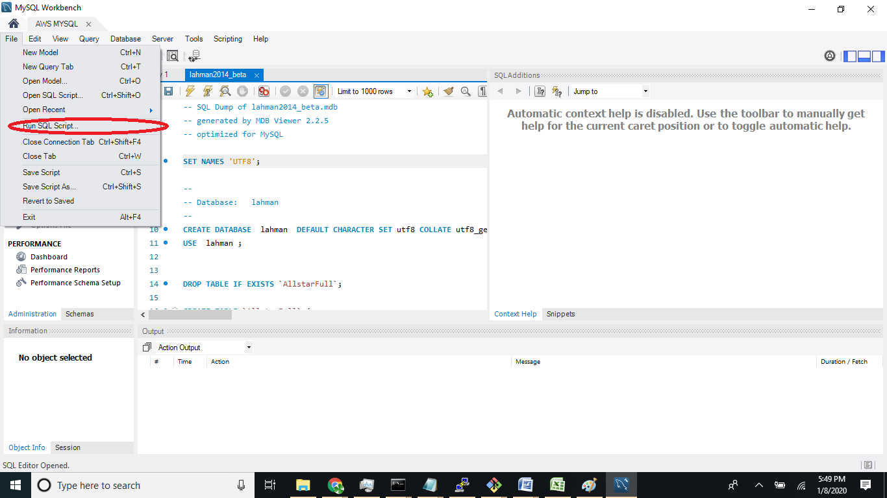
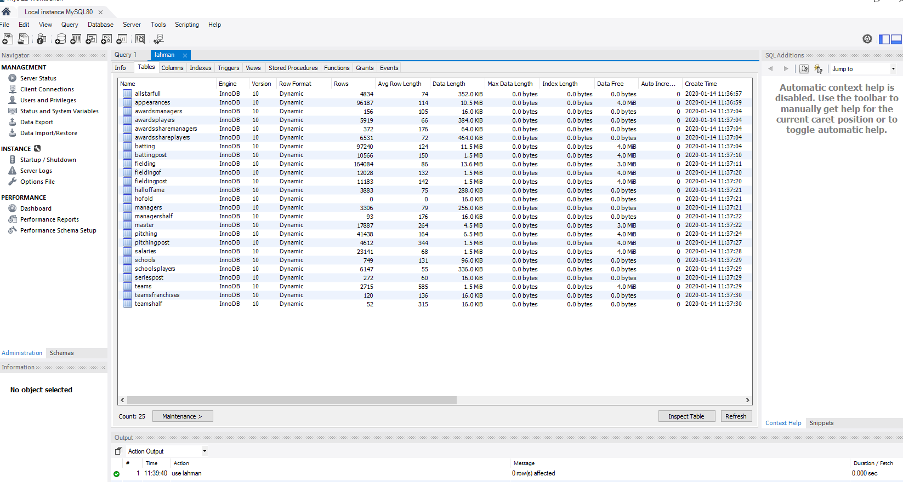

# Vanderbilt - Big Data 2020 - Homework 1

**Due Date 27 January 2020**

In this homework assignment (Three Parts), you will:

 * Verify your account on AWS
 * Set up and upload MLB Data in to MySQL instance (described below).
 * Write solutions to selected programming questions (Part 2 and Part 3)
 * Query and analyze MLB data 

# Useful Information

## Repositories

Repositories will be created for each student. You should see yours at 

    https://github.com/vu-bigdata-2020/homework-1-<GITHUB USERNAME> 

Clone the repository to your home directory on the cluster using:

    git clone https://github.com/vu-bigdata-2020/homework-1-<GITHUB USERNAME>.git

I may push updates to this homework assignment in the future. To setup an upstream repo, do the following:

    git remote add upstream https://github.com/vu-bigdata-2020/homework-1.git

To pull updates do the following:
    
    git fetch upstream
    git merge upstream/master

You will need to resolve conflicts if they occur. 

## Github

To push code to your repo use the git commit and push commands. But first set some settings:

	git config --global user.name "Your Name"
	git config --global user.email you@example.com

Once you modify files, use git's add, commit and push commands to push files to your repo. 

	git add file.txt
	git commit -a -m 'commit message'
	git push origin master

If you would like to use SSH keys on Github, follow the instructions at:

	https://help.github.com/articles/generating-a-new-ssh-key-and-adding-it-to-the-ssh-agent/0

## Updating the python Notebook URL after accepting the assignment on classroom.github.com

Once you have accepted the assignment, upate all notebooks (*.ipynb) as discussed in in https://github.com/vu-bigdata-2020/lectures/blob/master/00-assignmentInstructions/AcceptingaGithubassignment.pdf

## AWS
To access AWS go to https://aws.amazon.com/education/awseducate/ and use the account you created when you were invited to the class. Ensure that you can access this account and can land into an AWS console as shown below.


# Part 1 (50 points)

## Step-1 Create the MYSQL Instance

Follow the instructions at https://aws.amazon.com/getting-started/tutorials/create-mysql-db/ to create a mysql database instance. Follow the instructions carefully to remain within **free tier**. That last part is very important.

Also to ensure that you can connect this from google colab you will need to ensure that you choose Public accessibliity (see the image on https://aws.amazon.com/getting-started/tutorials/create-mysql-db/ in the configure advanced settings section.). 

Lastly, you should choose the default VPC. But create a new VPC security group. Once that group is created you can open the inbound connection to 0.0.0.0/0 (Anywhere) for port 3306 - the mysql port. See https://docs.aws.amazon.com/vpc/latest/userguide/VPC_SecurityGroups.html for reference.

Note that once you start it can take 10-15 minutes for the RDS instance to be provisioned


## Step 2 - Populate the MySQL instance

Download MySQL Workbench and connect to the database you created in the first step. Follow the Step 2 at https://aws.amazon.com/getting-started/tutorials/create-mysql-db/. 

Then load the lahman data into mysql from [data/lahman2012.sql](data/lahman2012.sql). See [readme2012.txt](data/readme2012.txt) for details about this MLB data.

To load the data first connect your SQL workbench to your database on AWS and then load sql script referenced above (lahman2012.sql) from Run SQL Script prompt. Choose default schema. It will create a database called lahman.



Once it hs been loaded you can execute the query "show databases" and it will show you a number of databases included lahman. See below


You can also issue the queries "use lahman" (i.e. select this database for use), followed by another query "show tables" and then click on the inspector icon to open the inspector for database where you can get a view like below that describes all tables. You can explore this view and also see all the columns in tables. see the two images below.




## Step 3- Check initial Colab Connection

Run the Colab connection script [testcolabconnection.ipynb](testcolabconnection.ipynb) and ensure that you get the connection and the number of tables correctly. Make sure that you update the database name, the username and the password. 

**Remember** to update the python notebook as discussed in https://github.com/vu-bigdata-2020/lectures/blob/master/00-assignmentInstructions/AcceptingaGithubassignment.pdf

Remember to shutoff the RDS instance when you are not using it.

## Step 4 -  Queries 

Implement all the SQL queries identified in mlb.ipynb. Record the answers in the mlb.ipynb and save it back to your repository.

**Remember** to update the python notebook as discussed in https://github.com/vu-bigdata-2020/lectures/blob/master/00-assignmentInstructions/AcceptingaGithubassignment.pdf

use https://www.w3schools.com/sql/default.asp as reference.

The queries are

1. The number of all stars in allstarfull.
2. The most home runs in a season by a single player (using the batting table).
3. The playerid of the player with the most home runs in a season.
4. The number of leagues in the batting table.
5. Barry Bond's average batting average (playerid = 'bondsba01') where batting average is hits / at-bats. Note you will nead to cast hits to get a decimal: cast(h as real)
6. The teamid with the fewest hits in the year 2000 (ie., yearid = '2000'). Return both the teamid, and the number of hits. Note you can use ORDER BY column and LIMIT 1.
7. The teamid in the year 2000 (i.e., yearid = '2000')  with the highest average batting average. Return the teamid and the average. To prevent divsion by 0, limit at-bats > 0.
8. The number of all stars the giants (teamid = 'SFN') had in 2000.
9. The yearid which the giants had the most all stars.
10. The average salary in year 2000.
11. The number of positions (e.g., catchers, pitchers) that have average salaries greather than 2000000 in yearid 2000. You will need to join fielding with salaries. Also consider using a HAVING clause.
12. The number of errors Barry Bonds had in 2000. 
13. The average salary of all stars in 2000.
14. The average salary of non-all stars in 2000.

You can test each query result using the  corresponding tests in the notebook.

To start solving this here are few hints. First understand the table and the data from http://www.seanlahman.com/files/database/readme2012.txt . Then execute the query describe tablename on mysql. you can describe other tables as well.

For example here is the response for 

```
describe batting
```
```
playerID	varchar(9)	NO	PRI	
yearID	int	NO	PRI	
stint	int	NO	PRI	
teamID	varchar(3)	YES		
lgID	varchar(2)	YES		
G	int	YES		
G_batting	int	YES		
AB	int	YES		
R	int	YES		
H	int	YES		
2B	int	YES		
3B	int	YES		
HR	int	YES		
RBI	int	YES		
SB	int	YES		
CS	int	YES		
BB	int	YES		
SO	int	YES		
IBB	int	YES		
HBP	int	YES		
SH	int	YES		
SF	int	YES		
GIDP	int	YES		
G_old	int	YES		
```

You will notice that playerid, yearid and stintid together forms a composite primary key.

### Hint 1:

To solve the third query I can first find the max and then create an inner join as follows

```
select * from batting INNER Join (select MAX(HR) as m from batting) as data ON batting.hr=data.m
```

### Hint 2:

Initially you can formulate the queries and execute them directly through workbench. Once that is done and you like the result, copy the query to the python notebook

Solve the other queries similarly.

# Part 2 (20 Points)

Now for some programming fun. Implement the task defined in [testtarget.ipynb](testtarget.ipynb). 

**Remember** to update the python notebook as discussed in https://github.com/vu-bigdata-2020/lectures/blob/master/00-assignmentInstructions/AcceptingaGithubassignment.pdf

# Part 3 (30 points)

Create an AWS machine instance. Follow instructions at https://github.com/vu-bigdata-2020/lectures/blob/master/00-aws-setup-guide/AWS-guide-2019.pptx. You should ensure that you set up ssh key pair. 

## Step 1 - Login to the machine and clone homework repository

Login to your instance. Clone the homework repository. You can use either the http access method for git or the ssh. I suggest ssh. See https://help.github.com/articles/generating-a-new-ssh-key-and-adding-it-to-the-ssh-agent for help


## Complete the parts in bash.py and fill the commands c1,c2,c3,c4,c5 and c6

for this part you will have to experiment Use cat, grep, wc, cut, sort, head and tail to implement the following tasks.
You can use the man page for each command for detailed instructions.

1. c1: A command to count the lines in bonds.csv found in the data subfolder of your homework repo.
2. c2: A command to count the number of lines between 2000-2009. The second column is the year.
3. c3: A command to count the number of lines not between 2000-2009.
4. c4: A command to extract the largest number of games Bonds played in a year. Games played is column six.
5. c5: A command to extract the distinct teams Bonds played for. Team is column four.
6. c6: A command to extract the year from the first row in file.

The bash.py will run these commands for you if you issue from the root folder of the cloned repository.

```python
python3 bash.py
```

It will also run tests and tell you which test is failing.

To submit response, commit the bash.py back in the repo, ensure that it has been correctly pushed. Validate by visiting github.com over browser. You can use any editor locally to fill in and edit the python file. But ensure that tabs are correctly set.

if you use vim, you can set  that up in your ~/.vimrc file with:

```
set expandtab           " enter spaces when tab is pressed
set textwidth=120       " break lines when line length increases
set tabstop=4           " use 4 spaces to represent tab
set softtabstop=4
set shiftwidth=4        " number of spaces to use for auto indent
set autoindent          " copy indent from current line when starting a new line
```


